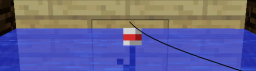
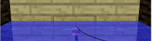
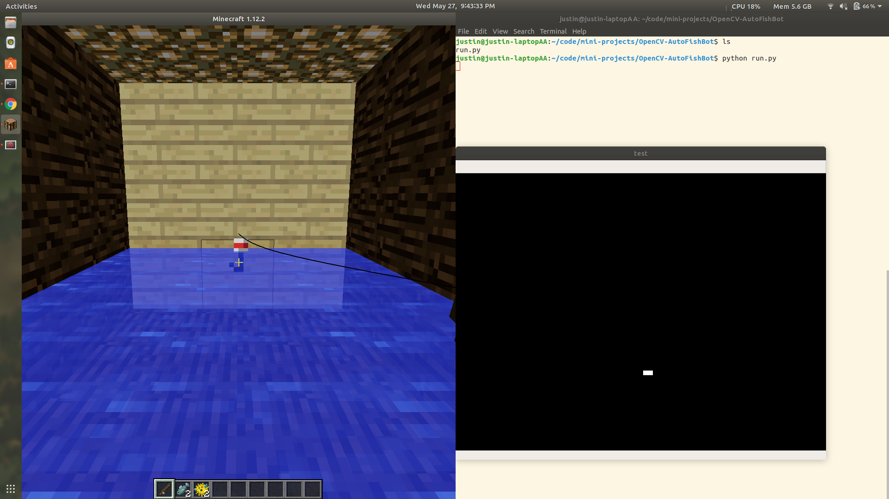

# Python OpenCV - Minecraft Autofisher

<strong>The Concept:</strong>

	1. Use 'mss' to grab a live screen recording.
	2. Use 'OpenCV' to process fishing bob in each frame.
	3. Use xdotool to initiate auto-clicks.
	4. Keep independent from the java-launcher (thus no mods / separate launcher necessary).

<strong>The Process: </strong>I noticed that an easy way to determine the appropriate time to catch a fish is when the red fishing bob dips beneath the water surface. As a result, the color of the bob will change from a bright red to a muddy color due to the discoloration from the water.

<strong>What the bob looks like above the surface and not ready to catch a fish: </strong>

<strong>What the bob looks like below the surface and ready to catch a fish: </strong>

<strong>How it works: </strong> OpenCV analyzes each frame grabbed by mss. Before running the script, you need to take a screenshot of the bob above water and use a website to find the rgb value of the main red section of the bob. Then, adjust the lower and upper rgb ranges to about +-10 values for R,G,B (FYI OpenCV uses BGR order). Once the script begins it will go through a sequence of time delays to allow you to adjust your windows accordingly. You will need to put Minecraft on the left half your screen and terminal/frames on the right side. 

